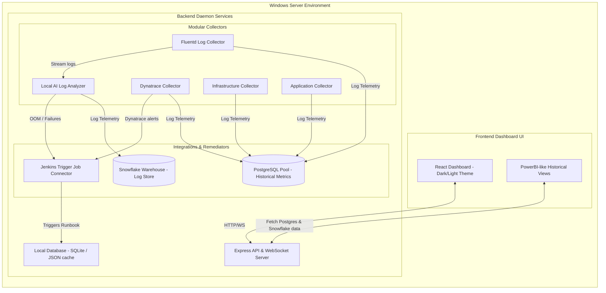

# Intelligent Observability & Autonomous Recovery Framework

An enterprise self-hosting portal that automates metric collection, provides log pattern anomaly detection using a simulated local AI engine, and triggers automated Jenkins remediation jobs (with manual or autonomous runbook controls) across core infrastructure and application layers.

---

## 💻 Tech Stack

*   **Frontend**: React (JS, Vite, HTML5, CSS3)
    *   **Styling**: Pure CSS Variables supporting **Dark / Light theme toggling**
    *   **Visualizations**: PowerBI-like layouts using responsive custom inline SVG analytics charts
*   **Backend**: Node.js, Express, WebSockets (`ws`)
*   **Simulated Data Warehouses**:
    *   **PostgreSQL**: Captures historical metrics timeseries data
    *   **Snowflake**: Serves as the logs data lake audit store
*   **Hosting**: Native Windows Server deployment (via `start.bat` startup and task scheduler hooks)

---

## 📐 Architecture Diagram



---

## ⚙️ Staging (STG) Environment Configuration Guide

To deploy this application in a real Staging (STG) environment, all connection configurations have been unified into a single configuration file:

*   **Config File**: [`backend/config.js`](file:///c:/Users/sspra/OneDrive/Desktop/iosph2/backend/config.js)
    *   `USE_SIMULATED_COLLECTORS`: Set to `false` to activate real staging network pings.
    *   `STG_URLS`: Configures endpoints for Avi APIs, Postgres JDBC strings, NAS folder mounts, S3, Bitbucket, Artifactory, NexusIQ, Fortify, TeamCity, ArgoCD, MCP, and Jenkins integrations.
    *   `POSTGRES_STG_CONFIG` & `SNOWFLAKE_STG_CONFIG`: Connection pools parameters for the historical database and Snowflake data lake logs index.

---

## 📦 Yarn & pnpm Package Manager Support

Instead of `npm`, you can use `yarn` or `pnpm` to install dependencies and compile the workspace:

### Using pnpm:
```bash
# Install root and frontend workspace dependencies
pnpm install
cd frontend && pnpm install

# Compile React client build target files
pnpm run build-frontend

# Boot backend server daemon
pnpm start
```

### Using Yarn:
```bash
# Install dependencies
yarn install
cd frontend && yarn install

# Compile React client files
yarn build-frontend

# Boot backend server daemon
yarn start
```

---

## 🐍 Python & Selenium Active UI Checks Setup

For applications requiring active browser simulations (SSO authentication checks, page-load latency timings, dashboard validations), the real collectors spawn a headless Chrome instance using Python and Selenium.

### Prerequisite Installation:
1. Ensure Python 3 is installed and added to your system `PATH`.
2. Install the Selenium and WebDriver Manager packages using `pip`:
   ```bash
   pip install -r backend/collectors/real/python_checks/requirements.txt
   ```
3. The Node backend dynamically spawns the browser check script [`selenium_ui_check.py`](file:///c:/Users/sspra/OneDrive/Desktop/iosph2/backend/collectors/real/python_checks/selenium_ui_check.py) as a child process during real telemetry collection cycles. If Python dependencies are missing, the collector logs a warning and falls back to baseline defaults automatically without crashing.

---

## ⚡ Local Windows Server Execution

1.  **Deployment**:
    Double-click `start.bat` to download packages, compile production client files, and launch the portal.
2.  **Background Hosting Service**:
    Open PowerShell as Administrator and run `./install_service.ps1` to configure the observability loop to start on Windows Server boot as a background task.

