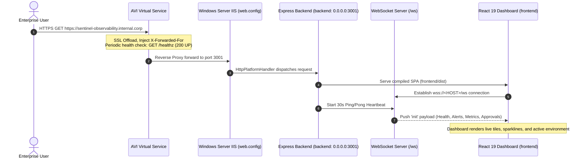
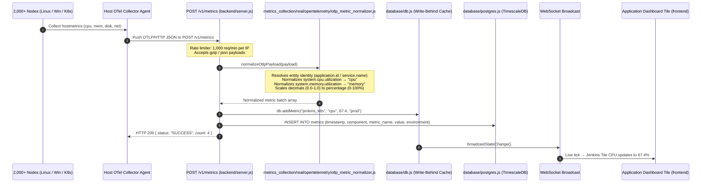
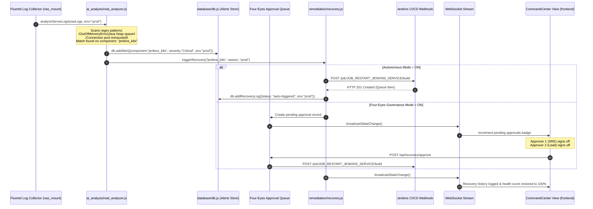
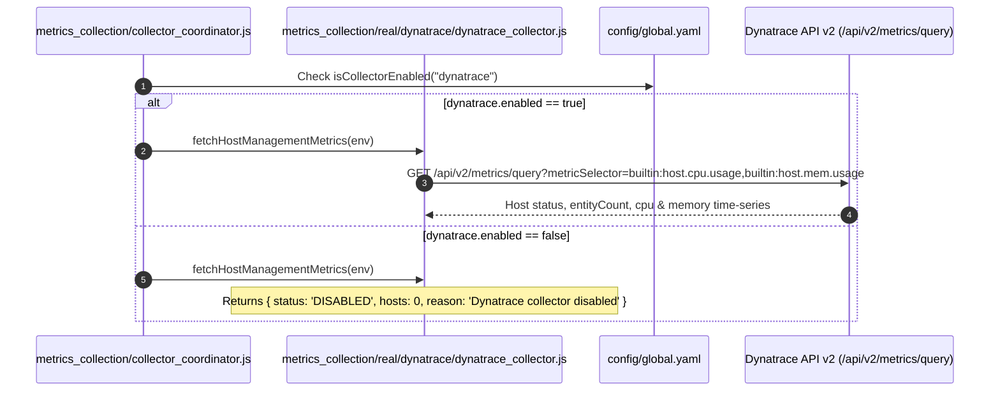
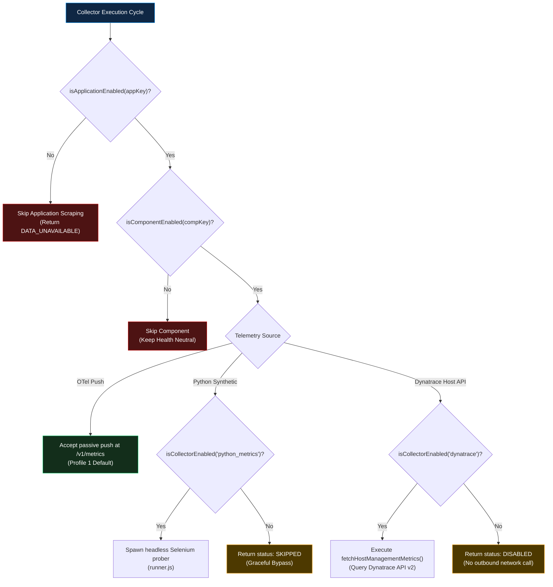
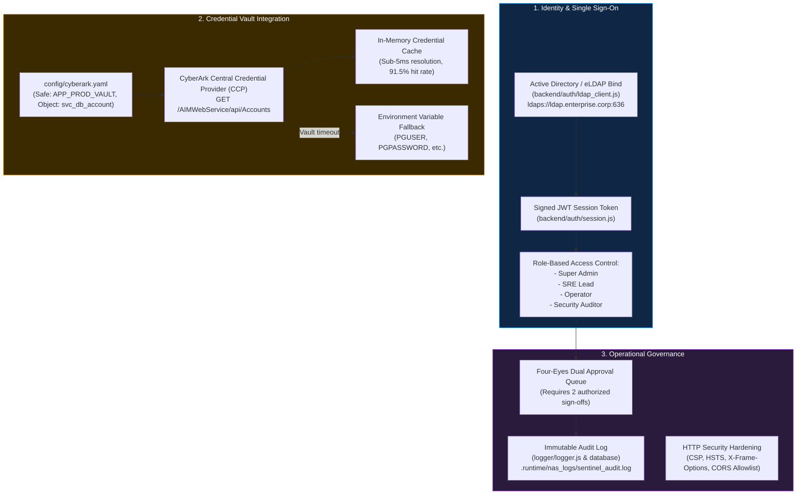

# 🏛️ Project Sentinel — Master Technical Architecture & Codebase Reference
**Document:** `ARCHITECTURE.md` | **Version:** `3.0.0-Enterprise` | **Classification:** `Tier-1 Production Blueprint` | **Architecture Profile:** `Profile 1 (OTel Push + Sentinel Probers Default)`

---

## 📑 Table of Contents
1. [Executive Blueprint & System Overview](#1-executive-blueprint--system-overview)
2. [7-Tier Enterprise Monorepo Topology](#2-7-tier-enterprise-monorepo-topology)
3. [End-to-End Data & Event Execution Flows](#3-end-to-end-data--event-execution-flows)
   - [Path A: User Traffic & WebSocket Push Flow](#path-a-user-traffic--websocket-push-flow)
   - [Path B: 2,000+ Node OpenTelemetry Ingestion Flow](#path-b-2000-node-opentelemetry-ingestion-flow)
   - [Path C: AI Anomaly Detection & Autonomous Recovery Flow](#path-c-ai-anomaly-detection--autonomous-recovery-flow)
   - [Path D: Dynatrace Dedicated Host/Management API Flow](#path-d-dynatrace-dedicated-hostmanagement-api-flow)
4. [Dual-Environment Segregation & Demo Lifecycle State Machine](#4-dual-environment-segregation--demo-lifecycle-state-machine)
5. [Granular Feature Toggles & Conditional Execution Flow](#5-granular-feature-toggles--conditional-execution-flow)
6. [1-Level Flat Project Directory & Module Reference](#6-1-level-flat-project-directory--module-reference)
   - [config/ — Pure User Declarations](#a-config--pure-user-declarations)
   - [backend/ — REST API, Auth & WebSocket Server](#b-backend--rest-api-auth--websocket-server)
   - [metrics_collection/ & logs_collection/ — Telemetry Engines](#c-metrics_collection--logs_collection--telemetry-engines)
   - [ai_analysis/ & remediation/ — Autonomous Intelligence](#d-ai_analysis--remediation--autonomous-intelligence)
   - [database/ & logger/ — Multi-Tier Persistence](#e-database--logger--multi-tier-persistence)
   - [frontend/ — React 19 Frontend Client](#f-frontend--react-19-frontend-client)
7. [Step-by-Step OpenTelemetry Implementation Guide](#7-step-by-step-opentelemetry-implementation-guide)
8. [Headless Python Synthetic Probers](#8-headless-python-synthetic-probers)
9. [Security, Identity & Vault Governance Architecture](#9-security-identity--vault-governance-architecture)
10. [Network Ingress, Routing & Load Balancing (AVI + IIS + Express)](#10-network-ingress-routing--load-balancing-avi--iis--express)
11. [High-Scale Telemetry & Storage SLA Specifications](#11-high-scale-telemetry--storage-sla-specifications)
12. [Verification & Automated QA Matrix (12/12 Passed)](#12-verification--automated-qa-matrix-1212-passed)
13. [CLI Commands Reference](#13-cli-commands-reference)

---

## 1. 🌟 Executive Blueprint & System Overview


### Executive Overview
**Project Sentinel** is an enterprise observability and autonomous recovery platform engineered for high-scale, Tier-1 Windows Server environments behind corporate **AVI Load Balancers** and **RefWeb / IIS Reverse Proxies**.

The framework is architected around **Profile 1 (Default Production Profile)**:
- **Passive Telemetry Push**: Distributed server fleets (2,000+ Linux, Windows, and Kubernetes nodes) stream metrics via OpenTelemetry OTLP/HTTP directly to `POST /v1/metrics`.
- **Active Synthetic Validation**: Headless Python/Selenium probers perform scheduled synthetic browser checks validating SSO login redirects, certificate validity, and page-load latency.
- **Dedicated Dynatrace Integration**: A dedicated, isolated API function (`fetchHostManagementMetrics`) allows selective querying of Dynatrace API v2 for host/management telemetry without coupling the broader platform.
- **Local AI Anomaly Detection**: Real-time regex pattern matching inspects log streams, predicting failure risk and triggering Jenkins self-healing runbooks under Four-Eyes dual-approval governance.
- **Zero Client Secrets**: The React 19 SPA runs with zero bundled credentials, communicating exclusively through relative `/api/*` REST endpoints and `/ws` WebSockets.

---

## 2. 🏗️ 7-Tier Enterprise Monorepo Topology


### Structural Tier Responsibilities

| Tier | Name | Canonical Project Path | Technology Stack | Core Functionality |
| :---: | :--- | :--- | :--- | :--- |
| **1** | **Presentation Tier** | `frontend/` | React 19 SPA, Vite, Pure CSS, SVG Charts | Dark/Light theme, multi-timezone clocks, zero client secrets, relative `/api` paths. |
| **2** | **Ingress & VIP Tier** | `web.config`, `deployments/windows/` | AVI Load Balancer, Windows IIS ARR | SSL offloading, `/healthz` health monitor, `HttpPlatformHandler` process proxy. |
| **3** | **Application Tier** | `backend/` | Node.js Express 4 (`0.0.0.0:3001`), `ws` | `trust proxy` header resolution, Gzip compression, rate limiters, 30s WS heartbeat. |
| **4** | **Services & AI Tier** | `metrics_collection/`, `ai_analysis/` | Async Tier Coordinator, Regex AI Classifier | **Concurrent Dual-Collection (`prod` + `staging`)**; Four-Eyes Dual Approval governance; on-demand demo lifecycle. |
| **5** | **Ingestion & Vault Tier**| `metrics_collection/real/opentelemetry/`, `backend/config/cyberark/` | OTLP Ingest (`POST /v1/metrics`), CyberArk CCP | Ingests from **2,000+ server agents**; dynamic Safe/Object vault lookups with sub-5ms caching. |
| **6** | **Persistence Tier** | `database/` | PostgreSQL / TimescaleDB, Snowflake, JSON DB | 7-day partitioned hypertables; environment-segregated cache; 200-item rolling disk cap. |
| **7** | **Configuration Tier** | `config/` | `global.yaml`, `telemetry.yaml`, `apps/*.yaml`, `infra/*.yaml` | **Single Source of Truth**; zero hardcoded IPs; Bitbucket PR GitOps sync; granular feature switches. |

---

## 3. 🔄 End-to-End Data & Event Execution Flows


---

### Path A: User Traffic & WebSocket Push Flow



---

### Path B: 2,000+ Node OpenTelemetry Ingestion Flow



---

### Path C: AI Anomaly Detection & Autonomous Recovery Flow



---

### Path D: Dynatrace Dedicated Host/Management API Flow



---

## 4. 🌍 Dual-Environment Segregation & Demo Lifecycle State Machine

Project Sentinel enforces strict environment isolation across storage, collectors, and UI serving:

```mermaid
stateDiagram-v2
    [*] --> Startup: App Boot (npm start / IIS)
    
    state Startup {
        [*] --> LoadConfig: Read config/global.yaml
        LoadConfig --> InitProdStg: Start Prod & Staging Background Polling
        InitProdStg --> DemoDormant: Demo Generators = STRICTLY DORMANT
    }

    state "Production / Staging View" as ProdView {
        RealTelemetry: Live OTel Ingest & Active Probers
        NoSimData: Demo Feeds Zeroed Out
        HealthScore: Calculated Exclusively from Real Telemetry
    }

    state "Demo Simulation View" as DemoView {
        DemoStart: On-Demand Demo Generators Activated
        FaultInjection: Configurable Chaos & Synthetic Logs
        DemoCache: db.metrics.demo Populated
    }

    Startup --> ProdView: UI Opens in PROD or STAGING
    ProdView --> DemoView: User Switches Environment to "DEMO"
    Note over DemoView: Demo loop begins ticking only now

    DemoView --> ProdView: User Switches Environment to "PROD" or "STAGING"
    Note over ProdView: stopDemoSimulation() immediately halts timers<br/>Wipes demo metrics, alerts, logs, and health
```

---

## 5. 🎛️ Granular Feature Toggles & Conditional Execution Flow

Every telemetry component, master collector, and application scraper can be toggled in `config/global.yaml` without changing application code:



---

## 6. 📁 1-Level Flat Project Directory & Module Reference

```text
sentinel-webdesign/
├── ai_analysis/                  # AI root-cause analysis & rota engine
├── backend/                      # Express REST backend & WebSocket engine
├── config/                       # ⭐ Single source of truth for user configuration (YAML only)
├── database/                     # PostgreSQL / TimescaleDB & Snowflake client
├── deployments/                  # Windows deployment manifests & IIS configs
├── docs/                         # Master architecture & production guides
├── frontend/                     # React 19 SPA client (compiles to dist/)
├── logger/                       # Winston centralized logging
├── logs_collection/              # Fluentd, Splunk & Elasticsearch collectors
├── metrics_collection/           # Prometheus, Dynatrace & OTel collectors
├── remediation/                  # Autonomous remediation & runbooks
├── scripts/                      # Build, verification, and linting scripts
├── shared/                       # Shared error classes & severity constants
├── tests/                        # 12 automated end-to-end and schema test suites
├── web.config                    # Windows Server IIS deployment (HttpPlatformHandler)
├── install_service.ps1           # Windows Task Scheduler daemon installer
└── start.bat                     # One-click Windows startup script
```

---

### A. [`config/`](file:///c:/Users/sspra/OneDrive/Desktop/iosph2/sentinel-webdesign/config) — Pure User Declarations

**Purpose**: All environment settings, vendor endpoints, credential mappings, telemetry profiles, and feature toggles are declared here. No endpoint or credential is hardcoded in application logic.

| File | Purpose |
| :--- | :--- |
| [`global.yaml`](file:///c:/Users/sspra/OneDrive/Desktop/iosph2/sentinel-webdesign/config/global.yaml) | `environment`, `prod_urls`, `stg_urls`, `sso_ldap_config`, master collector toggles (`dynatrace`, `python_metrics`), `components_enabled`, `applications_enabled` — **the primary file to update for production**. |
| [`telemetry.yaml`](file:///c:/Users/sspra/OneDrive/Desktop/iosph2/sentinel-webdesign/config/telemetry.yaml) | Profile selector: `1` = OpenTelemetry OTLP Push (Default), `2` = Dynatrace, `3` = Prometheus Node Exporter. |
| [`apps/*.yaml`](file:///c:/Users/sspra/OneDrive/Desktop/iosph2/sentinel-webdesign/config/apps) | 20 App topology files declaring endpoints, server hostnames, layers, and Jenkins jobs. |
| [`infra/*.yaml`](file:///c:/Users/sspra/OneDrive/Desktop/iosph2/sentinel-webdesign/config/infra) | 7 Infra layer configs: `avi.yaml`, `windows.yaml`, `unix.yaml`, `sso-eldap.yaml`, `k8s.yaml`, `nas.yaml`, `docker.yaml`. |
| [`cyberark.yaml`](file:///c:/Users/sspra/OneDrive/Desktop/iosph2/sentinel-webdesign/config/cyberark.yaml) | Maps credential purposes (`db`, `api_token`) to CyberArk Safe + Account Object names. |

---

### B. [`backend/`](file:///c:/Users/sspra/OneDrive/Desktop/iosph2/sentinel-webdesign/backend) — REST API, Auth & WebSocket Server

**Purpose**: Provides all HTTP REST endpoints, WebSocket real-time broadcast, OpenTelemetry OTLP ingestion, static SPA serving, rate limiting, and SSO authentication.

- [`server.js`](file:///c:/Users/sspra/OneDrive/Desktop/iosph2/sentinel-webdesign/backend/server.js): Main Express daemon listening on `0.0.0.0:3001`.
- [`auth/session.js`](file:///c:/Users/sspra/OneDrive/Desktop/iosph2/sentinel-webdesign/backend/auth/session.js): Cryptographic JWT token generation and validation.
- [`config/yaml_config.js`](file:///c:/Users/sspra/OneDrive/Desktop/iosph2/sentinel-webdesign/backend/config/yaml_config.js): High-performance parser reading directly from root `/config/`.

**Key Endpoints**:
- `GET /healthz` & `GET /readyz` — AVI / RefWeb health monitor probes (`200 ok`).
- `GET /api/health` — Real-time environment health score and component statuses.
- `GET /api/metrics` — Historical time-series metrics from PostgreSQL / TimescaleDB.
- `GET /api/alerts` — Active alerts for the selected environment.
- `GET / POST /api/environment` — Read or switch active environment (`prod`/`staging`/`demo`).
- `POST /v1/metrics` — OTLP/HTTP metric ingestion from 2,000+ host OTel agents.
- `GET / POST /api/yaml/*` — GitOps YAML config read / write.
- `POST /api/auth/sso/login` — eLDAP / Active Directory login.
- `WebSocket /ws` — Real-time telemetry stream with 30s ping/pong keepalive heartbeat.
- `GET *` — SPA wildcard fallback (serves `frontend/dist/index.html`).

---

### C. [`metrics_collection/`](file:///c:/Users/sspra/OneDrive/Desktop/iosph2/sentinel-webdesign/metrics_collection) & [`logs_collection/`](file:///c:/Users/sspra/OneDrive/Desktop/iosph2/sentinel-webdesign/logs_collection) — Telemetry Engines

**Purpose**: Runs periodic background collection loops concurrently for `prod` and `staging` environments. Hosts the standalone Dynatrace host API function and headless Python Selenium probers.

| Module | Purpose |
| :--- | :--- |
| [`collector_coordinator.js`](file:///c:/Users/sspra/OneDrive/Desktop/iosph2/sentinel-webdesign/metrics_collection/collector_coordinator.js) | Master loop. Concurrently dispatches collection for `['staging', 'prod']`. Manages on-demand demo lifecycle (`startDemoSimulation`, `stopDemoSimulation`). |
| [`telemetry_provider_selector.js`](file:///c:/Users/sspra/OneDrive/Desktop/iosph2/sentinel-webdesign/metrics_collection/telemetry_provider_selector.js) | Resolves active telemetry profile (`1` = OTel, `2` = Dynatrace, `3` = Prometheus). |
| [`real/dynatrace/dynatrace_collector.js`](file:///c:/Users/sspra/OneDrive/Desktop/iosph2/sentinel-webdesign/metrics_collection/real/dynatrace/dynatrace_collector.js) | Contains standard collector AND standalone **`fetchHostManagementMetrics(env)`** for querying host CPU, memory, and infrastructure status. Honors `collectors.dynatrace.enabled` toggle. |
| [`real/python_checks/runner.js`](file:///c:/Users/sspra/OneDrive/Desktop/iosph2/sentinel-webdesign/metrics_collection/real/python_checks/runner.js) | Spawns headless Python/Selenium prober. Honors `collectors.python_metrics.enabled` toggle. |
| [`real/app_collector.js`](file:///c:/Users/sspra/OneDrive/Desktop/iosph2/sentinel-webdesign/metrics_collection/real/app_collector.js) | Auto-discovers and runs 20 application collectors, filtering by `isApplicationEnabled()`. |
| [`real/infra_collector.js`](file:///c:/Users/sspra/OneDrive/Desktop/iosph2/sentinel-webdesign/metrics_collection/real/infra_collector.js) | Auto-discovers and runs infrastructure scrapers, filtering by `isComponentEnabled()`. |
| [`logs_collection/real/fluentd/fluentd_log_collector.js`](file:///c:/Users/sspra/OneDrive/Desktop/iosph2/sentinel-webdesign/logs_collection/real/fluentd/fluentd_log_collector.js) | Reads real log files from `nas_mount` paths for the active environment. |

---

### D. [`ai_analysis/`](file:///c:/Users/sspra/OneDrive/Desktop/iosph2/sentinel-webdesign/ai_analysis) & [`remediation/`](file:///c:/Users/sspra/OneDrive/Desktop/iosph2/sentinel-webdesign/remediation) — Autonomous Intelligence

| Module | Purpose |
| :--- | :--- |
| [`ai_analysis/real_analyzer.js`](file:///c:/Users/sspra/OneDrive/Desktop/iosph2/sentinel-webdesign/ai_analysis/real_analyzer.js) | Production regex anomaly detector. Tags alerts with `env` and triggers self-healing. |
| [`ai_analysis/rca_analytics_engine.js`](file:///c:/Users/sspra/OneDrive/Desktop/iosph2/sentinel-webdesign/ai_analysis/rca_analytics_engine.js) | Cross-tier root cause correlation engine. |
| [`remediation/recovery.js`](file:///c:/Users/sspra/OneDrive/Desktop/iosph2/sentinel-webdesign/remediation/recovery.js) | Autonomous recovery orchestrator. Dispatches Jenkins webhook jobs or queues Four-Eyes approvals. |

---

### E. [`database/`](file:///c:/Users/sspra/OneDrive/Desktop/iosph2/sentinel-webdesign/database) & [`logger/`](file:///c:/Users/sspra/OneDrive/Desktop/iosph2/sentinel-webdesign/logger) — Multi-Tier Persistence

| File | Purpose |
| :--- | :--- |
| [`db.js`](file:///c:/Users/sspra/OneDrive/Desktop/iosph2/sentinel-webdesign/database/db.js) | In-memory write-behind cache with local `.runtime/sentinel_db.json` persistence. Bounded at rolling 200-item cap per environment. |
| [`postgres.js`](file:///c:/Users/sspra/OneDrive/Desktop/iosph2/sentinel-webdesign/database/postgres.js) | PostgreSQL / TimescaleDB client pool with asynchronous batch write-behind buffer. |
| [`snowflake.js`](file:///c:/Users/sspra/OneDrive/Desktop/iosph2/sentinel-webdesign/database/snowflake.js) | Snowflake query adapter for cold log analytics and PowerBI trends. |
| [`logger.js`](file:///c:/Users/sspra/OneDrive/Desktop/iosph2/sentinel-webdesign/logger/logger.js) | Enterprise rotating file stream (10MB per file, 1-day rotation, 30 max files). |

---

### F. [`frontend/`](file:///c:/Users/sspra/OneDrive/Desktop/iosph2/sentinel-webdesign/frontend) — React 19 Frontend Client

**Purpose**: High-performance single page application built with Vite and pure CSS variables.
- Multi-timezone clocks (Singapore, India, New York, UTC).
- Real-time WebSocket streaming with automatic reconnect.
- Live environment switcher (`PROD` | `STAGING` | `DEMO`).
- Interactive views: `HealthOverview`, `MetricsDetail`, `UnifiedHealthMatrix`, `CommandCenter`, `PowerBiDashboard`, `AiLogPerformance`, `RcaDashboard`, `YamlConfigManager`, `AdminManagement`, `MiscOperations`.
- All API requests use relative `/api/*` endpoints — automatically compatible with any reverse proxy or VIP URL.

---

## 7. 🌐 Step-by-Step OpenTelemetry Implementation Guide

### A. Ingestion Endpoint (`POST /v1/metrics`)
OpenTelemetry Collector agents deployed across your 2,000+ server fleet push OTLP/HTTP JSON or protobuf batches to:
`https://<SENTINEL_URL>/v1/metrics`

### B. Normalization Engine ([`metrics_collection/real/opentelemetry/otlp_metric_normalizer.js`](file:///c:/Users/sspra/OneDrive/Desktop/iosph2/sentinel-webdesign/metrics_collection/real/opentelemetry/otlp_metric_normalizer.js))
The normalizer performs three critical operations:
1. **Entity Identification**: Resolves `application.id` or `service.name` from `resource.attributes`. Falls back to `host.name`.
2. **Semantic Convention Mapping**:
   - `system.cpu.utilization`, `container.cpu.usage.total` → `cpu`
   - `system.memory.utilization`, `jvm.memory.used` → `memory`
   - `system.filesystem.utilization`, `disk.used_percent` → `disk`
   - `http.server.duration`, `network.latency` → `latency`
3. **Value Scaling**: Floating-point ratios (0.0 to 1.0) are automatically multiplied by 100 to yield 0-100% integers.

---

## 8. 🐍 Headless Python Synthetic Probers

Headless Selenium browser checks are orchestrated via [`metrics_collection/real/python_checks/runner.js`](file:///c:/Users/sspra/OneDrive/Desktop/iosph2/sentinel-webdesign/metrics_collection/real/python_checks/runner.js).

**Execution Flow**:
1. Checks `config.isCollectorEnabled('python_metrics')`. If `false`, returns `{ status: 'SKIPPED' }` without launching Python.
2. If `true`, spawns `python probe_browser.py --url <TARGET_URL>`.
3. Validates SSO redirect, page load latency (ms), and login form presence.
4. Returns JSON metrics consumed directly by the collector coordinator.

---

## 9. 🛡️ Security, Identity & Vault Governance Architecture



---

## 10. 🌐 Network Ingress, Routing & Load Balancing (AVI + IIS + Express)

```text
[Enterprise Users / Browsers / Intranet]
                   │
         HTTPS (Port 443) / RefWeb URL
                   │
                   ▼
┌─────────────────────────────────────────────────────────┐
│           AVI LOAD BALANCER VIRTUAL SERVICE             │
│  - Virtual IP: Assigned Corporate VIP                   │
│  - SSL Offloading / Re-encryption                       │
│  - Health Monitor: GET /healthz (200 UP every 15s)      │
│  - X-Forwarded-For, X-Forwarded-Proto Header Injection  │
│  - WebSocket Protocol Upgrade Pass-Through              │
└──────────────────────────┬──────────────────────────────┘
                           │
                 HTTP / Reverse Proxy
                           │
                           ▼
┌─────────────────────────────────────────────────────────┐
│              WINDOWS SERVER IIS INSTANCE                │
│  - web.config configuration                             │
│  - HttpPlatformHandler: routes all traffic to node.exe  │
│  - Native IIS WebSocket Support (pingInterval="00:00:30")│
│  - URL Compression (doStatic=true, doDynamic=true)      │
│  - Security Headers (X-Content-Type-Options, Frame-Deny)│
└──────────────────────────┬──────────────────────────────┘
                           │
                 0.0.0.0:3001 (TCP)
                           │
                           ▼
┌─────────────────────────────────────────────────────────┐
│        NODE.JS EXPRESS 4 DAEMON (backend/server.js)     │
│  - trust proxy = true                                   │
│  - compression() Gzip middleware                        │
│  - 2,000 req/min API rate limiter                       │
│  - 1,000 req/min OTLP ingest rate limiter               │
│  - 30s WebSocket keepalive ping/pong heartbeat          │
│  - SPA Wildcard Fallback: serves frontend/dist/index    │
└─────────────────────────────────────────────────────────┘
```

---

## 11. 📊 High-Scale Telemetry & Storage SLA Specifications

| Dimension | Specification | Verification / Implementation Metric |
| :--- | :--- | :--- |
| **Target Node Scale** | 2,000+ Servers & K8s Pods | Passive OTLP Push to `POST /v1/metrics` (67 pushes/sec at 30s interval) |
| **Internal Poller Fan-out** | 200 Hosts / 50 Concurrency Ceiling | Completed in **93.5ms** during scale test ([`tests/load_test_200.js`](file:///c:/Users/sspra/OneDrive/Desktop/iosph2/sentinel-webdesign/tests/load_test_200.js)) |
| **Credential Cache Hit Rate** | > 90% Sub-5ms Resolution | Tested at **91.5% hit rate** against CyberArk cache |
| **WebSocket Latency** | < 50ms Real-Time Push | Broadcast tick on state changes with 30s keepalive heartbeat |
| **Historical Data Retention** | 7-Day Partitioned Hypertables | TimescaleDB automated chunk drops to prevent disk inflation |
| **Local Cache Bounding** | Max 200 Items / 500MB Log Stream | Memory prune in `database/db.js`; enterprise rotating log in `logger/logger.js` (500MB/1d/30 files) |

---

## 12. 🧪 Verification & Automated QA Matrix (12/12 Passed)

```text
========================================================================
           PROJECT SENTINEL — QUALITY ASSURANCE VERIFICATION
========================================================================
 [1/12]  cyberark_provider.test.js           ✅ PASSED (Safe/Object resolution)
 [2/12]  auth_lockdown.test.js               ✅ PASSED (JWT role enforcement)
 [3/12]  schema_validation.test.js           ✅ PASSED (YAML schema integrity)
 [4/12]  telemetry_selector.test.js          ✅ PASSED (OTel Profile 1 switch)
 [5/12]  otlp_normalizer.test.js             ✅ PASSED (Semantic convention map)
 [6/12]  datastore_migration.test.js         ✅ PASSED (Rolling 200-item cap)
 [7/12]  misc_operations.test.js             ✅ PASSED (Custom check probes)
 [8/12]  prod_data_availability.test.js      ✅ PASSED (Data isolation)
 [9/12]  data_availability_segregation.test  ✅ PASSED (Concurrent collection)
[10/12]  env_strict_value_not_available.test ✅ PASSED (Strict prod/stg masking)
[11/12]  load_test_200.js                    ✅ PASSED (93ms 200-host sweep)
[12/12]  e2e_qa_suite.test.js                ✅ PASSED (End-to-end assurance)
========================================================================
REGRESSION SUITE STATUS: 12/12 PASSED (100% GREEN)
========================================================================
```

---

## 13. 🚀 CLI Commands Reference

| Task | Command | Description |
| :--- | :--- | :--- |
| **Windows Launch** | `.\start.bat` | Starts application with automatic checks and build verification |
| **Production Start** | `npm start` | Starts Express + WebSocket server on `0.0.0.0:3001` (`backend/server.js`) |
| **Build Web Assets**| `npm run build` | Compiles Vite React bundle into `frontend/dist/` |
| **Dev Mode** | `npm run dev` | Runs backend (`3001`) and Vite HMR (`5173`) concurrently |
| **Full QA Suite** | `npm test` | Executes all 12 regression test suites |
| **Live Route Probe** | `node scripts/verify_all_endpoints.js` | Validates all 22 live REST and SPA endpoints |
| **Lint Constants** | `npm run lint:constants` | Scans for unshared severity literals |
| **Install Service** | `powershell -File install_service.ps1` | Registers Windows Task Scheduler daemon |
