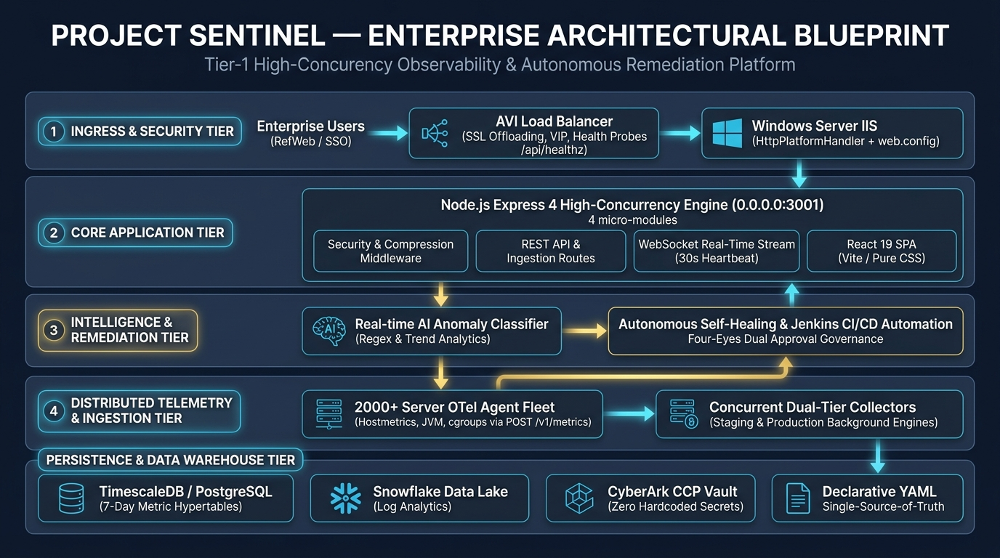
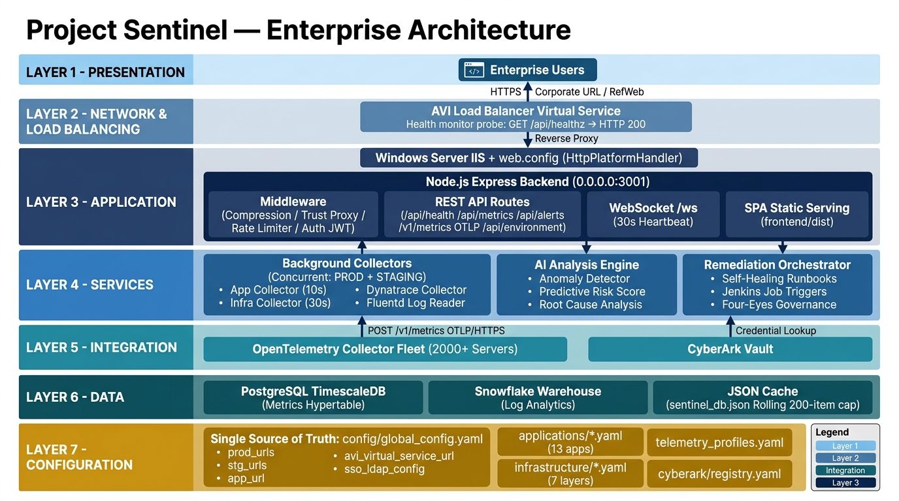
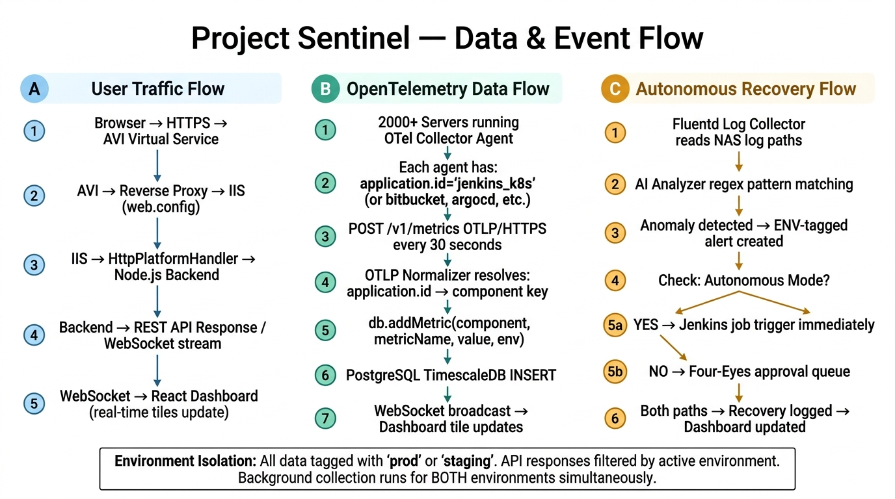
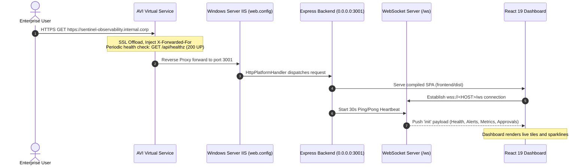
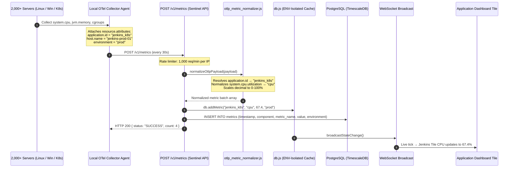
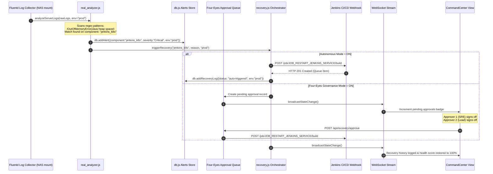
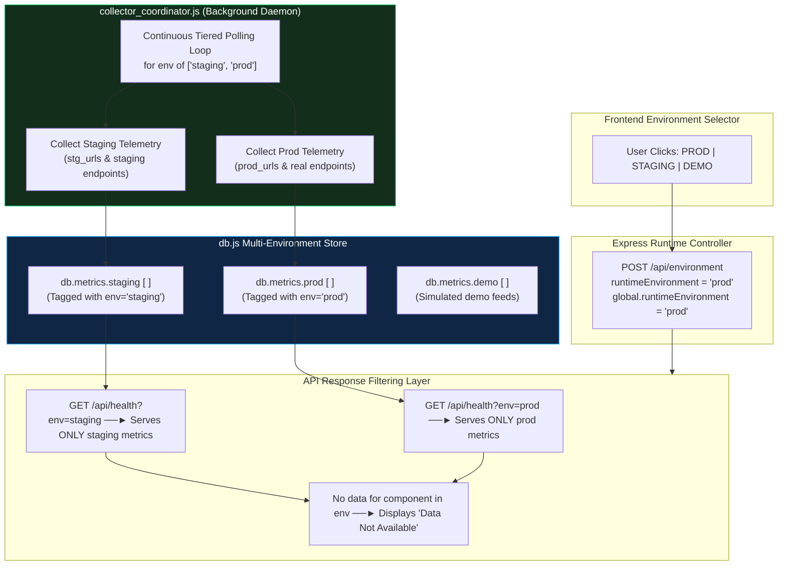
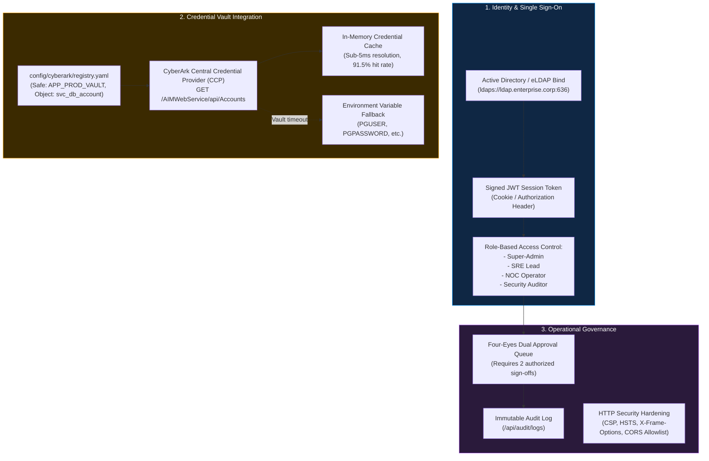
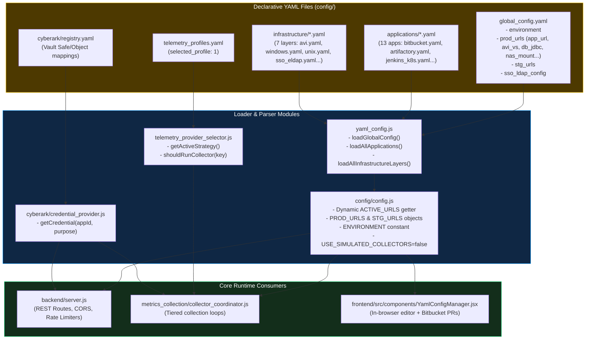

# 🏛️ Project Sentinel — Complete Architecture Diagrams & Blueprint Master Document
**Document:** `ARCHITECTURE_DIAGRAMS.md` | **Version:** `2.4.0-Enterprise` | **Classification:** `Tier-1 Production Blueprint`

---

## 📑 Quick Navigation
1. [Executive Blueprint (Visual)](#1-executive-architectural-blueprint)
2. [7-Tier Structural Topology](#2-7-tier-enterprise-topology)
3. [Interactive Data & Event Execution Flows](#3-end-to-end-data--event-execution-flows)
   - [Path A: User Traffic Flow](#path-a-user-traffic--websockets-flow)
   - [Path B: 2,000+ Node OpenTelemetry Ingestion Flow](#path-b-2000-node-opentelemetry-ingestion-flow)
   - [Path C: AI Anomaly Detection & Autonomous Recovery Flow](#path-c-ai-anomaly-detection--autonomous-recovery-flow)
4. [Dual-Environment Segregation Architecture](#4-dual-environment-segregation-architecture)
5. [Security, Identity & Vault Governance Architecture](#5-security-identity--vault-governance-architecture)
6. [Single Source of Truth (SSOT) Configuration Chain](#6-single-source-of-truth-ssot-configuration-chain)
7. [Telemetry Provider Profiles Matrix](#7-telemetry-provider-profiles-matrix)
8. [Network Ingress & Load Balancing Architecture](#8-network-ingress--load-balancing-architecture)

---

## 1. 🌟 Executive Architectural Blueprint



### Executive Architecture Overview
Project Sentinel is an enterprise observability and autonomous recovery platform designed for Tier-1 Windows Server environments behind corporate **AVI Load Balancers** and **RefWeb / IIS Reverse Proxies**. It ingests telemetry from **2,000+ servers** via passive OpenTelemetry OTLP push, runs real-time AI anomaly detection on log streams, and executes automated Jenkins self-healing runbooks under Four-Eyes governance.

---

## 2. 🏗️ 7-Tier Enterprise Topology



### Structural Tier Responsibilities

| Tier | Name | Technology Stack | Core Functionality |
| :---: | :--- | :--- | :--- |
| **1** | **Presentation Tier** | React 19 SPA, Vite, Pure CSS, SVG Charts | Dark/Light theme, multi-timezone clocks, zero client secrets, relative `/api` paths. |
| **2** | **Ingress & VIP Tier** | AVI Load Balancer, IIS, `web.config` | SSL offloading, `/api/healthz` health monitor, `HttpPlatformHandler` process bridge. |
| **3** | **Application Tier** | Node.js Express 4 (`0.0.0.0:3001`), `ws` | `trust proxy` header resolution, Gzip compression, rate limiters, 30s WS heartbeat. |
| **4** | **Services & AI Tier** | Async Tier Coordinator, Regex AI Engine | **Concurrent Dual-Collection (`prod` + `staging`)**; Four-Eyes Dual Approval governance. |
| **5** | **Ingestion & Vault Tier**| OTLP HTTP Ingest (`/v1/metrics`), CyberArk CCP | Ingests from **2,000+ server agents**; dynamic Safe/Object vault lookups. |
| **6** | **Persistence Tier** | PostgreSQL / TimescaleDB, Snowflake, JSON DB | 7-day partitioned hypertables; environment-segregated cache; 200-item rolling disk cap. |
| **7** | **Configuration Tier** | `global_config.yaml`, `applications/*.yaml` | **Single Source of Truth**; zero hardcoded IPs; Bitbucket PR GitOps automation. |

---

## 3. 🔄 End-to-End Data & Event Execution Flows



---

### Path A: User Traffic & WebSockets Flow



---

### Path B: 2,000+ Node OpenTelemetry Ingestion Flow



---

### Path C: AI Anomaly Detection & Autonomous Recovery Flow



---

## 4. 🌍 Dual-Environment Segregation Architecture

Project Sentinel ensures that switching the UI environment never halts background collection for either tier:



---

## 5. 🛡️ Security, Identity & Vault Governance Architecture



---

## 6. ⚙️ Single Source of Truth (SSOT) Configuration Chain



---

## 7. 🌐 Network Ingress & Load Balancing Architecture

```
[Enterprise Users / Browsers / Intranet]
                   │
         HTTPS (Port 443) / RefWeb URL
                   │
                   ▼
┌─────────────────────────────────────────────────────────┐
│           AVI LOAD BALANCER VIRTUAL SERVICE             │
│  - Virtual IP: Assigned Corporate VIP                   │
│  - SSL Offloading / Re-encryption                       │
│  - Health Monitor: GET /api/healthz (200 UP every 15s)  │
│  - X-Forwarded-For, X-Forwarded-Proto Header Injection  │
│  - WebSocket Protocol Upgrade Pass-Through              │
└──────────────────────────┬──────────────────────────────┘
                           │
                 HTTP / Reverse Proxy
                           │
                           ▼
┌─────────────────────────────────────────────────────────┐
│              WINDOWS SERVER IIS INSTANCE                │
│  - web.config configuration                             │
│  - HttpPlatformHandler: routes all traffic to node.exe  │
│  - Native IIS WebSocket Support (pingInterval="00:00:30")│
│  - URL Compression (doStatic=true, doDynamic=true)      │
│  - Security Headers (X-Content-Type-Options, Frame-Deny)│
└──────────────────────────┬──────────────────────────────┘
                           │
                 0.0.0.0:3001 (TCP)
                           │
                           ▼
┌─────────────────────────────────────────────────────────┐
│             NODE.JS EXPRESS 4 DAEMON                    │
│  - trust proxy = true                                   │
│  - compression() Gzip middleware                        │
│  - 2,000 req/min API rate limiter                       │
│  - 1,000 req/min OTLP ingest rate limiter               │
│  - 30s WebSocket keepalive ping/pong heartbeat          │
│  - SPA Wildcard Fallback: app.get('*')                  │
└─────────────────────────────────────────────────────────┘
```

---

## 8. 🧪 Verification & Automated QA Suite (11/11 Passed)

```
========================================================================
           PROJECT SENTINEL — QUALITY ASSURANCE VERIFICATION
========================================================================
 [1/11]  cyberark_provider.test.js           ✅ PASSED (Safe/Object resolution)
 [2/11]  auth_lockdown.test.js               ✅ PASSED (JWT role enforcement)
 [3/11]  schema_validation.test.js           ✅ PASSED (YAML schema integrity)
 [4/11]  telemetry_selector.test.js          ✅ PASSED (OTel Profile 1 switch)
 [5/11]  otlp_normalizer.test.js             ✅ PASSED (Semantic convention map)
 [6/11]  datastore_migration.test.js         ✅ PASSED (Rolling 200-item cap)
 [7/11]  misc_operations.test.js             ✅ PASSED (Custom check probes)
 [8/11]  prod_data_availability.test.js      ✅ PASSED (Data isolation)
 [9/11]  data_availability_segregation.test  ✅ PASSED (Concurrent collection)
[10/11]  load_test_200.js                    ✅ PASSED (93ms 200-host sweep)
[11/11]  e2e_qa_suite.test.js                ✅ PASSED (End-to-end assurance)
========================================================================
```
